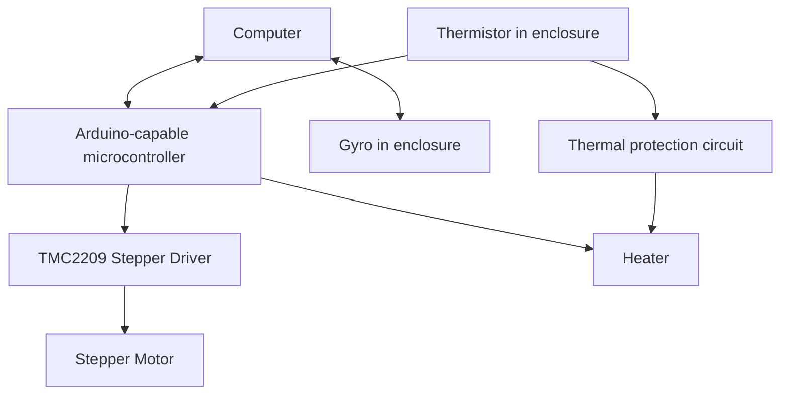
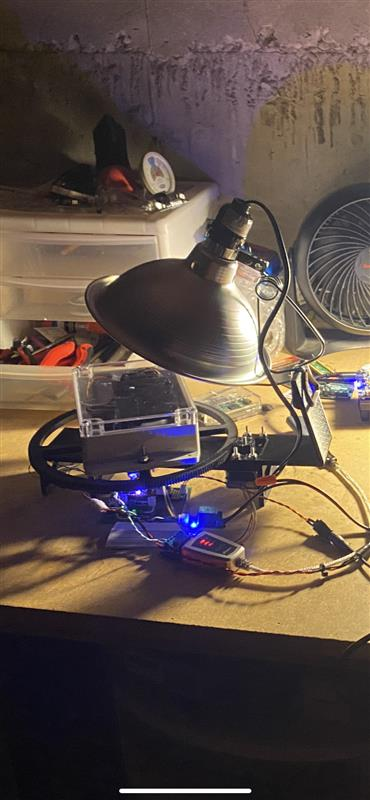
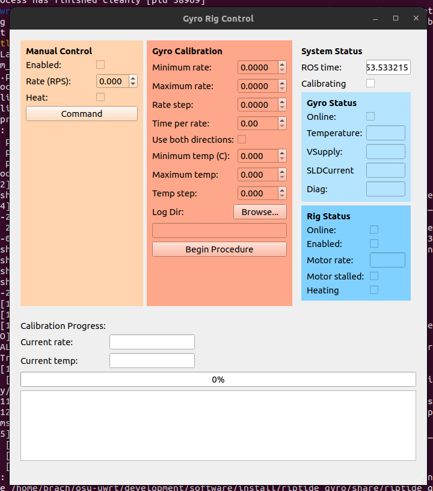
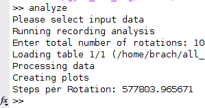
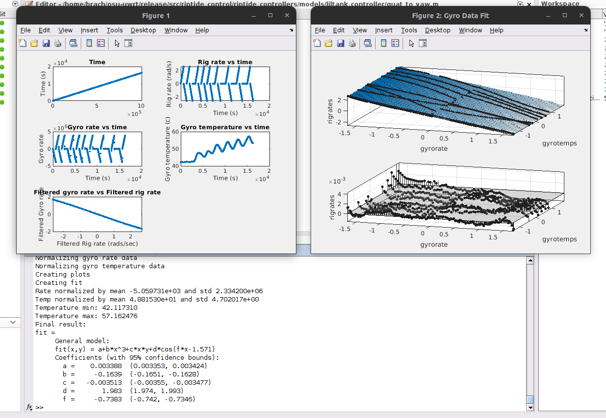
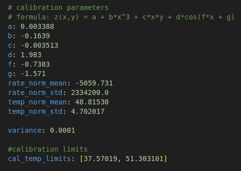
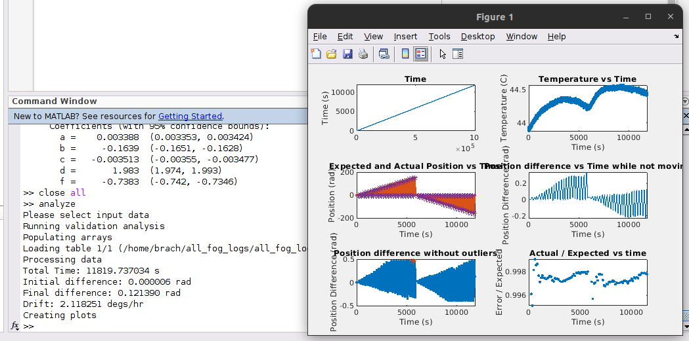

# gyro_cal_rig
Fiber optic gyro calibration rig control and ROS driver code.

This project enables users to calibrate any gyroscope using the UWRT Fiber Optic Gyro (FOG) calibration rig. This README will serve as a guide for anyone wishing to use this software to perform a gyro calibration or validation.

## UWRT Gyro Calibration rig
The UWRT gyro calibration rig consists of a weatherproof enclosure attached to a turntable which is rotated by a stepper motor and heated by some sort of heater. Both the stepper motor (controlled by a TMC2209) and heater are controlled by an Arduino-capable microcontroller (Uno, Nano, RP2040, etc), running the sketch available in the *arduino_driver* directory. Thus, the TMC2209 stepper driver must be connected via one-wire UART to MCU pins 10 (RX) and 11(TX), and the heater must be connected to pin A0. A thermal shutdown circuit should also be present to shut down the heater if the temperature of the enclosure passes a maximum threshold. A ROS-enabled computer must be connected to the MCU via the primary UART (or USB), and connected to the gyro via some serial interface. The below diagram provides some intuition of how components of the rig should be connected together.



A picture of UWRT's original calibration rig is shown below:



## Step 1: Calibrating the rig
This software does not assume the stepper motor being used, or the gear ratio of the stepper motor to the heated enclosure. Thus, the software does not know the actual rotational rate of the gyro until the stepper has been calibrated to the rig. Calibrating the rig is the process of obtaining the scalar factor used to convert steps/sec of the stepper to rads/sec of the gyro, and must be performed before the rig may be operated for calibration or validation purposes. This section will discuss how to to properly calibrate the rig.

First, properly connect and power on the rig. For rig calibration, only the stepper motor is required; there is no need to connect the gyro or heater.

After the rig is powered, on, launch the **rig recording** gyro procedure using the command: ```ros2 launch gyro_cal_rig rig_recording.launch.py robot:=<robot name>```. Please note that a UWRT robot name (e.g. talos or liltank) is required. This is because the launch file invokes a generic gyro bench launch which uses the navigation system for gyro validation purposes.

The launch command will spawn the gyro rig operator window, pictured below:


The window consists of four sections:
- **Manual control** (yellow) on the left, which allows the user to manually control the rig. We will use this section in this step
- **Gyro Calibration** (red) in the middle, which allows the user to define and run gyro procedures such as calibration and validation.
- **Status** (multiple colors) on the right, which displays the current state of the gyro and rig. The status is not populated in the screenshot above because the gyro and rig are not connected, but both "Online" checkboxes will be checked if the system has been brought up properly.
- **Progress** on the bottom, which displays the progress of the currently running procedure.

In the **Gyro Calibration** pane, select a log directory using the "Browse..." button, then select "Begin Procedure".

In the **Manual control** pane, enable and activate the stepper by checking the "enabled" checkbox, entering a small number (e.g. 0.001) into the "Rate" box, and pressing "Command". The stepper should move at a fixed rate. Once this is working, slowly increase the rate of the stepper and keep count of the number of rotations the rig (not the stepper) turns. Let it complete at least 100 revolutions before stopping the rig by setting the rate back to 0. After stopping the rig, press "Cancel procedure" to end the procedure. A log file with the date and time of the start of the procedure will now be present and accessible in the chosen log directory. Do not rename the log file as the name helps the MATLAB analysis script determine how to analyze the data.

**NOTE: It is critical that the stepper motor does not skip during this time. If the stepper skips, this procedure needs to be repeated.**

Launch MATLAB and add the *matlab* directory of this repository to the path. Then, run the ```analyze``` command. MATLAB will prompt you to open a file. Select the log file you just created. Then, when prompted, enter the actual number of rotations through which the rig enclosure rotated. After processing for a couple of seconds, the analysis script will output the rig calibration value as "Steps per Rotation".



This number must be pasted at the top of the following files:
- gyro_procedure.launch.py
- analyzeCalibration2Files.m
- analyzeCalibrationFiles.m

## Step 2: Calibrating the Gyro
With the rig calibrated, the calibration2 procedure may now be run. The calibration2 procedure will heat the rig to the desired temperature, then rotate the gyro at incrementally increasing rates to build a surface which can be used to relate gyro output and temperature to actual rotation. Use the command ```ros2 launch gyro_cal_rig gyro_calibration2.launch.py robot:=<robot name>``` to launch the calibration. Note that there is also a *calibration.launch.py* launch file which performs a decent calibration, but the calibration procedure used by *calibration2.launch.py* will be quicker and have higher quality.

Use the **Manual Control** pane to experimentally determine the maximum rate at which the rig can rotate before the stepper starts skipping. This value minus 10% should be the value used by the calibration. 

Then, enable the heater and let it run for a while, tuning the thermal shutoff circuit to your desired maximum temperature. 

Now, use the GUI to configure the calibration as such:
- **Minimum Rate**: Use 0.
- **Maximum Rate**: Use the value for max rotational rate you obtained earlier.
- **Rate Step**: Use a small value. The smaller the value, the more resolution your data will have but the longer the calibration will take. Taking the maximum rate divided by 50 is typically a good value for this.
- **Time per rate**: Using 16 seconds provides a sufficiently fast calibration while also providing good sample averaging.
- **Use both directions**: This should be checked.
- **Minimum Temp (C)**: Set this to one or two degrees below the current temperature of the gyro. 
- **Maximum Temp(C)**: Set this to a couple of degrees lower than the maximum observed temperature of the gyro in the rig.
- **Temp Step**: Set this appropriately to include 4 or 5 temperatures in the calibration. Note that the temperatures will not be tightly controlled as they are only being controlled via a bang-bang technique.

Finally, select a log directory and click "Begin Calibration" to start. Depending on the parameters you chose, the calibration may last for several hours. 

Note that it may be desireable to run multiple calibrations to include different temperature ranges. As an example, one could run an indoor calibration to cover gyro use at room temperature, then run a calibration outside during the summertime to collect data at higher temperatures near the gyro's limit. It is alright to run these as separate calibrations, as the MATLAB script supports processing multiple files at a time.

After the desired calibration files are collected, launch MATLAB and add the *matlab* directory to the path. Run the ```analyze``` command again, and select any calibration2 log files you would like to include. After processing, MATLAB will print out a curve fit with scalars a, b, c, d, and f, and other parameters, which can be entered into the *gyro_config.yaml* file in the riptide_hardware2 package.



Above: calibration script output



Above: gyro configuration file

## Step 3: Validating the Calibration
After successfully obtaining the gyro calibration surface parameters, it is important to validate them to know whether or not the calibration will be usable. The validation procedure will rotate the gyro in one direction, pause for a while, then rotate in the other direction. This is good to evaluate gyro drift over time while stationary and ensure that the gyro outputs correct rates while rotating. Launch the validation procedure using ```ros2 launch gyro_cal_rig gyro_validation.launch.py robot:=<robot name>```

The parameters may be configured very similarly to those of the calibration2 procedure, with a couple important changes:
- **Time Per Rate**: This should be much higher than the 16 seconds used for the calibration2. One minute is a good value to use for this. 
- Disabling temperature by setting it to zero will yield a quicker validation. Generally, validating the temperature is less important at this stage.

Before starting the procedure, you may want to tare the gyro using the RViz panel. This will eliminate almost all of the static drift that will be observed by the procedure. However, you may choose to skip this step if evaulation of the overall performance of the calibration is desired.

After configuring the calibration and taring the gyro, select a log directory, then select "Begin Calibration" to begin the procedure. The validation procedure will generally take much longer to complete than the calibration2 procedure.

After successfully completing the validation procedure, launch MATLAB, add the *matlab* directory to the path, run the ```analyze``` command, and select your validation file. The script will produce a figure with several plots, each describing a different aspect of the validation procedure and the gyro performance:
- The time plot prints ROS time, allowing the user to detect discontinuities between the two that may indicate an issue with the procedure (e.g. the process falling asleep). 
- The temperature vs time plot displays temperature vs time.
- Expected and actual position vs time shows the expected position (position of the rig) and actual position (position of the gyro) vs time. Local minima and maxima are highlighted by points on both traces.
- Position difference vs time while not moving displays the difference between expected and actual positions while the rate of the rig is zero. This allows the user to visually see drift if it is ocurring.
- Position difference without outliers shows the difference between expected and actual positions at all times during the validation procedure, with outliers removed. This allows the user to see errors in the calibration while the gyro is moving.
- Actual / Expected position displays the ratio of actual gyro position to expected gyro position, allowing the user to observe if the calibration may be improved by scaling the output.

The script will also print drift information to the console.



BK
